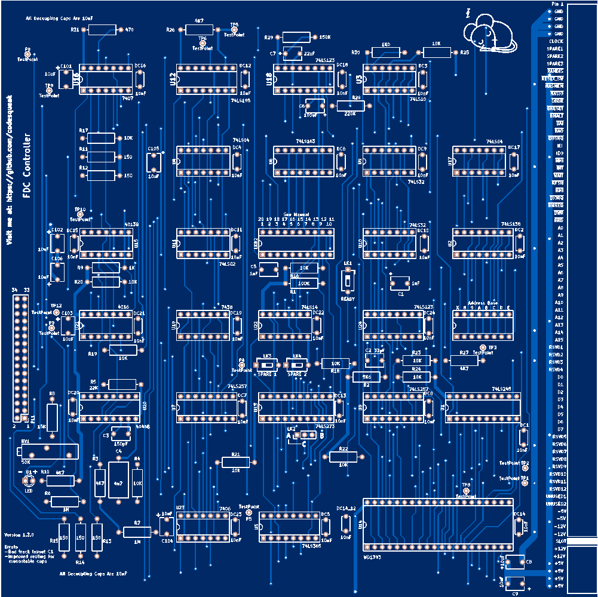

# Floppy Disk Controller Version 1.3.0

Nascom / Gemini / 80-Bus 1793 Floppy Disk Controller

## Introduction

This card has been designed to be a functional replacement for the Nascom Floppy Disk Controller.  It is fully compatible with the existing NAS-DOS software

The card is a completely new implementation of the design with a number of improvements over the original:

*	Completely new track layout
*	All components are readily available from commercial component suppliers (..and eBay!)
*	Switches are fitted to standard  DIL sockets
*	Copious test points
* Full documentation

For full documentation, see the [pdf here](FDC.pdf).  

 

  
